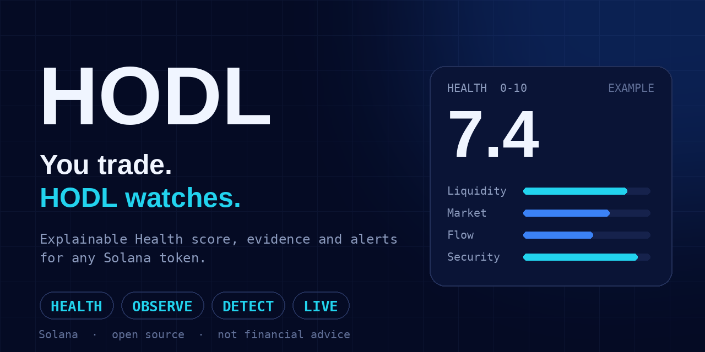

# HODL

**Health · Observe · Detect · Live**

Paste a Solana token address. Get an explainable 0-10 Health score, the evidence behind it, and a push alert when something material changes.

**[Open the app](https://hodlterminal.vercel.app)** · [Methodology](https://hodlterminal.vercel.app/methodology) · [Docs](docs/)

> HODL watches. You decide. It never connects a wallet, swaps, or tells you what to buy or sell.

## What it does

- **Scan:** a deterministic Health score with a factor breakdown, caps and plain-language reasons, plus a live chart and identity facts.
- **Watch:** a per-device watchlist, re-scanned on a schedule, with web push alerts.
- **Alert rules:** per-event switches and thresholds, per-token overrides and muting.
- **Your Mark:** save a token's price and Health, see what changed, and get pinged when price crosses your own level.
- **Posted CA:** whether the token's own linked X account posted its contract address, and an alert when it does.
- **X post alerts:** posts from tracked accounts that mention a token's address, under a hard daily spend cap.
- **Whale activity:** large buys and sells via a Helius webhook.
- **Share pages:** public `/t/<mint>` pages with a preview card.
- **Device linking:** share one watchlist across browsers with a one-time 6-character code.
- **Installable PWA.**

## How Health works

Health is a 0-10 measurement of observable market conditions. It is not a prediction and not a signal.

1. 28 checks turn observations into 0-10 values, or N/A when data is missing.
2. Seven domains average their checks: Market 15%, Liquidity 25%, Flow 15%, Holders 15%, Creator 10%, Security 15%, Lifecycle 5%.
3. Red-flag caps set a ceiling the score cannot exceed (for example rugged, collapsed liquidity, mint authority still set).
4. The score is versioned (currently `health-v0.3.0`) so old scores keep their meaning.

Missing data is never silently zero. Weights and caps are provisional. Full detail: [docs/health.md](docs/health.md) and the [live Methodology page](https://hodlterminal.vercel.app/methodology).

## Architecture

    paste mint -> validate -> provider adapters -> normalized market + identity
      -> Health (factors, caps) -> cached scan result

    watched token -> scheduled scan -> snapshot compare -> material events
      -> your rules -> push alert

Data comes from DexScreener, GeckoTerminal (backup), RugCheck, Helius and the X API. State lives in Upstash Redis. Scans are triggered by a cron endpoint. See [docs/architecture.md](docs/architecture.md).

## Run it locally

    git clone https://github.com/thejoshiebanks-a11y/hodl-watch.git
    cd hodl-watch
    npm install
    cp .env.example .env.local   # names only; add your own values
    npm run dev

Checks:

    npx tsc --noEmit && npm run lint && npx vitest run

## Limitations

Monitoring is scheduled polling, not live streaming, so alerts arrive after the next scan. Third-party data can be late or wrong, and HODL says so when it is degraded. "Posted CA" only covers the token's own linked account over the last 7 days. See [docs/limitations.md](docs/limitations.md).

## Roadmap

- Clone detection and richer identity labels
- Custom rules such as "Health below 4"
- Event-driven monitoring over Solana WebSockets
- Email alerts

## Docs

[architecture](docs/architecture.md) · [data sources](docs/data-sources.md) · [events](docs/events.md) · [detection](docs/detection.md) · [health](docs/health.md) · [limitations](docs/limitations.md) · [security](SECURITY.md) · [contributing](CONTRIBUTING.md)

## About

Built in about two weeks, entirely from an iPhone, with Claude as a coding assistant. HODL shows observed data, not financial advice. Trading memecoins is very high risk.

MIT licensed. Charts by TradingView Lightweight Charts™.
